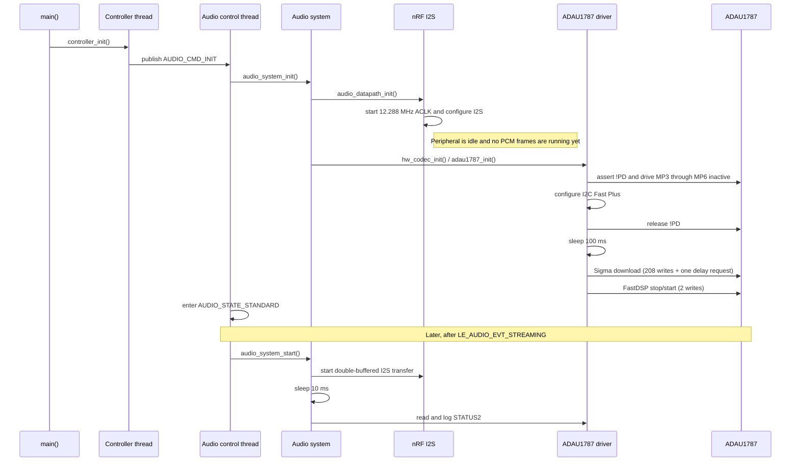

# ADAU1787 Startup Process

This document describes the ADAU1787 startup behavior implemented by this
repository. It follows the path from application boot to live PCM traffic and
separates two operations that happen at different times:

1. **Codec initialization** resets, releases, and programs the ADAU1787.
2. **Audio stream startup** starts the nRF5340 I2S peripheral and then reports
   the codec's lock and power status.

The codec is therefore programmed before BCLK and LRCK begin toggling.

## Source Map

| Responsibility | Source |
| --- | --- |
| Application entry point | `src/main.c` |
| Top-level initialization command | `src/application/controller.c` |
| Audio state machine | `src/audio/audio_control.c` |
| Audio subsystem initialization and stream startup | `src/audio/audio_system.c` |
| Hardware-codec abstraction | `src/modules/hw_codec.c` |
| ADAU1787 GPIO, I2C, programming, and status driver | `src/drivers/adau1787.c` and `src/drivers/adau1787.h` |
| SigmaStudio-to-driver adaptation macros | `src/drivers/SigmaStudioFW.h` |
| Generated SigmaDSP program, parameters, and register sequence | `src/SigmaStudioFiles/adau_1787_IC_1_SIGMA.h` |
| Generated FastDSP start sequence | `src/SigmaStudioFiles/adau_1787_IC_1_FAST.h` |
| Generated register and parameter symbols | `src/SigmaStudioFiles/*_REG.h` and `src/SigmaStudioFiles/*_PARAM.h` |
| Application devicetree pin override | `boards/tiresias_dk_nrf5340_cpuapp.overlay` |
| Base codec node and binding | `../boards/eesc-usp/tiresias_dk/tiresias_dk_nrf5340_cpuapp_common.dtsi` and `../boards/eesc-usp/tiresias_dk/dts/bindings/audio/adi,adau1787.yaml` |

The last two base-board files are supplied by the sibling `boards` repository,
not by this application repository. They remain compile-time dependencies
because the driver uses `DT_NODELABEL(adau_1787)`.

## End-to-End Sequence



The controller and audio-control threads are statically created by Zephyr.
`main()` does not call the codec driver directly. Instead, `controller_init()`
notifies the controller zbus channel. The controller enters
`CONTROLLER_STATE_INITIALIZING` and publishes `AUDIO_CMD_INIT`. The audio-control
thread consumes that command, enters `AUDIO_STATE_INITIALIZING`, and calls
`audio_system_init()`.

For the current headset configuration (`CONFIG_AUDIO_DEV=1`),
`audio_system_init()` follows the I2S/hardware-codec branch. The USB bypass is
only selected for a gateway built with `CONFIG_AUDIO_SOURCE_USB`.

## Compile-Time Hardware Description

The driver creates an `i2c_dt_spec` and five `gpio_dt_spec` objects from the
`adau_1787` devicetree node. Startup cannot be compiled without the node and
its required `powerdown-gpios` property.

### Control interface

The base board definition places the ADAU1787 on `i2c1`:

| Property | Effective configuration |
| --- | --- |
| I2C controller | `i2c1`, labeled `I2C_1` |
| 7-bit codec address | `0x2B` |
| SDA | P1.2 |
| SCL | P1.3 |
| Devicetree bus rate | Standard mode |
| Driver-selected bus rate | Fast Plus, requested at runtime |
| nRF concatenation buffer | 4092 bytes |

`adau1787_config_i2c()` looks up `I2C_1`, requests
`I2C_SPEED_FAST_PLUS`, and then verifies that the bus in the codec's
`i2c_dt_spec` is ready. The return value from `i2c_configure()` is currently not
checked; only binding and readiness failures are handled.

The generated SigmaStudio headers contain `DEVICE_ADDR_* = 0x50`, but that
value does **not** choose the target on this platform. `SigmaStudioFW.h` accepts
the generated `devAddress` argument and ignores it; every generated transfer is
forwarded to `adau1787_write()`, which uses the devicetree address `0x2B`.

### Reset, multipurpose, and audio pins

| Signal | Effective nRF5340 pin | Startup behavior |
| --- | --- | --- |
| ADAU1787 `!PD` | P1.0, active low | Asserted while GPIOs are configured, then released before programming |
| MP3 | P1.14 | Configured as inactive output (physical low) |
| MP4 | P1.15 | Configured as inactive output (physical low) |
| MP5 | P1.12 | Configured as inactive output (physical low) |
| MP6 | P1.13 | Configured as inactive output (physical low) |
| I2S MCK | P1.1 | Configured by I2S pinctrl |
| I2S SCK | P0.6 | Driven by the nRF5340 I2S master when the stream starts |
| I2S LRCK | P0.7 | Driven by the nRF5340 I2S master when the stream starts |
| I2S SDOUT | P0.4 | nRF5340 transmit data to the codec |
| I2S SDIN | P0.5 | Codec transmit data to the nRF5340 |

The application overlay performs a temporary pin swap: it moves MP3 through
MP6 onto the base board's original I2S data/clock pins and moves the four I2S
signals to P0.4 through P0.7. MCK remains on P1.1.

Zephyr's GPIO API uses logical levels. Because `!PD` is declared
`GPIO_ACTIVE_LOW`, configuring it with `GPIO_OUTPUT_ACTIVE` physically drives
the line low and holds the codec in power-down. Calling
`gpio_pin_set_dt(..., 0)` later drives it physically high and releases the
codec.

## Stage 1: Prepare the nRF Audio Interface

`audio_system_init()` first calls `audio_datapath_init()`, which registers the
I2S block-completion callback and calls `audio_i2s_init()`.

`audio_i2s_init()`:

1. Configures the nRF audio clock for 12.288 MHz.
2. Starts HFCLKAUDIO and waits without a timeout for the started event.
3. Applies the `i2s0` default pinctrl state.
4. Connects and enables the I2S interrupt.
5. Initializes I2S instance 0 and leaves it in the idle state.

The nRF5340 is the I2S master. The peripheral uses I2S format, left alignment,
stereo channels, ACLK as its source, and the selected application sample width.
The source defaults select 48 kHz, 16-bit audio, and a 128x MCK/LRCK ratio when
no build overlay changes those Kconfig choices. At this stage the peripheral is
configured but `nrfx_i2s_start()` has not been called, so regular BCLK/LRCK
frames are not yet running.

## Stage 2: Hold the Codec in Reset and Configure Pins

`hw_codec_init()` is a thin wrapper around `adau1787_init()`. The driver begins
by logging `Initializing audio codec...` and calls `adau1787_config_gpios()`.

The GPIO setup is deliberately ordered as follows:

1. Verify the `!PD` GPIO controller is ready.
2. Configure `!PD` as an active output, asserting the active-low pin. This
   gives every nRF5340 reset a corresponding codec reset/power-down pulse.
3. Verify and configure MP3, MP4, MP5, and MP6 one at a time as inactive
   outputs.

Each readiness or configuration failure stops this phase. A controller that is
not ready produces `-ENODEV`; a GPIO configuration error is propagated as
returned by Zephyr.

## Stage 3: Configure I2C and Release `!PD`

After the GPIOs are ready, the driver configures I2C and calls
`adau1787_power_up()`. Power-up writes logical zero to the active-low `!PD`
specifier, releasing the physical pin high. The firmware then sleeps for a
fixed 100 ms before making the first codec transfer.

There is no device-ID probe or readiness poll between release and programming.
The 100 ms delay is the only driver-level stabilization interval at this point.

## Stage 4: Load the SigmaDSP Configuration

`default_download_IC_1_Sigma()` is generated by SigmaStudio. The current export
contains 209 operations: 208 write calls and one requested delay. Each write
macro calls `adau1787_write()` directly and becomes a separate I2C transaction.

The generated sequence has these broad phases:

1. Stop the SigmaDSP (`SDSP_CTRL2 = 0x00`), set the initial DAC volume values,
   and power down the ADC/DAC/headphone block (`ADC_DAC_HP_PWR = 0x00`).
2. Program chip power and clock control, including `CHIP_PWR = 0x17`, clock
   control registers, PLL/microphone-bias/PGA power, and the SigmaDSP/FastDSP
   power controls.
3. Configure the power gates and complete signal path: ADCs, PGAs, microphone
   bias, digital microphones, DAC/headphone, interpolators, decimators, ASRCs,
   FastDSP, SigmaDSP, and keep-alive behavior.
4. Configure multipurpose pins, serial-clock pins, serial ports 0 and 1 and
   their routes, interrupt masks/status registers, self-boot/software-enable,
   and PDM input/output routing.
5. Burst-write the compiled SigmaDSP image and initial parameters:

   | Image | Control-port start address | Payload | DSP words |
   | --- | ---: | ---: | ---: |
   | SigmaDSP program | `0x5000` | 845 bytes | 169 x 40-bit words |
   | SigmaDSP parameters | `0x2000` | 72 bytes | 18 x 32-bit words |

6. Enable the analog conversion/output block (`ADC_DAC_HP_PWR = 0x3F`), set
   both final DAC volume bytes to `0x40`, and start the SigmaDSP
   (`SDSP_CTRL2 = 0x01`).

The generated register list is authoritative for exact routing and field
values. The phase names above summarize the order without duplicating more than
200 generated assignments that will change when the SigmaStudio project is
re-exported.

### Generated delay behavior

The generated sequence places `SIGMA_WRITE_DELAY` immediately after the first
`CHIP_PWR = 0x17` write. Its data array is `{0x00, 0x23}`. In the current
adapter, `SIGMA_WRITE_DELAY` calls `k_msleep(*(pData))`, so it consumes only the
first byte and requests a **0 ms sleep**. The array could be read as the
big-endian value `0x0023` (35), but the implementation does not combine its
bytes. Consequently, the only effective pre-download wait guaranteed by the
driver is the earlier 100 ms sleep after releasing `!PD`.

This detail matters when comparing a SigmaStudio capture to firmware traffic:
the generated delay entry does not produce a 35 ms gap in the current code.

## Stage 5: Start the FastDSP

After the Sigma download returns, `adau1787_init()` calls
`default_download_IC_1_Fast()`. The current FastDSP export contains only two
writes to `FDSP_RUN` at address `0xC061`:

1. Write `0x00` to stop the FastDSP.
2. Write `0x01` to start the FastDSP.

Taken together, initialization makes 210 I2C write transactions: 208 from the
Sigma download and two from the FastDSP sequence. The largest is the program
download, for which `adau1787_write()` builds an 847-byte local buffer: two
big-endian address bytes followed by 845 payload bytes.

## I2C Transfer Format and Error Latching

Every write uses this wire-level payload:

```text
[sub-address MSB] [sub-address LSB] [data byte 0] ... [data byte N]
```

`i2c_write_dt()` supplies the I2C target address from devicetree. The ADAU1787
then auto-increments its internal address during a burst. Reads first write the
same two-byte sub-address and then use a repeated-start read through
`i2c_write_read_dt()`.

The generated SigmaStudio macros discard individual return values. To retain
failure information, `adau1787_write()` stores any nonzero I2C result in the
file-static `adau_init_error`. Successful later writes do not clear it. After
both generated downloads finish, `adau1787_init()` checks that latch.

This arrangement has several consequences:

- A failed generated transfer does not immediately stop the remaining
  download; subsequent writes are still attempted.
- The initialization fails after the full sequence if any generated write
  failed.
- The latch is not reset at the beginning of `adau1787_init()`. If code calls
  initialization again after a failed attempt, the old error remains latched.
- Direct read failures and argument-validation failures outside the generated
  download are returned normally and do not use this latch.

Driver setup failures and the final latched programming error are passed to
`ERR_CHK_MSG`. In this repository that macro logs the supplied message and
error code, then calls `k_oops()`. Therefore `adau1787_init()` returns zero only
if execution reaches its final `Audio codec initialization done.` log; its
setup failures are fatal rather than ordinary recoverable returns in the
current call path.

## Stage 6: Start Live I2S and Check Status

Successful programming moves the audio state to `AUDIO_STATE_STANDARD`, but it
does not start PCM traffic. The codec stays powered and programmed while the
application waits for LE Audio.

When the audio-control thread receives `LE_AUDIO_EVT_STREAMING`, it calls
`audio_system_start()`:

1. Select the headset software-codec configuration.
2. Initialize the transmit and receive FIFOs if needed.
3. Initialize the LC3 software codec and its worker thread if required.
4. Call `hw_codec_default_conf_enable()`. This is currently a no-op returning
   zero; all meaningful ADAU1787 configuration came from the Sigma download.
5. Start the double-buffered I2S transfer through `audio_datapath_start()`.
   This is the point at which `nrfx_i2s_start()` enables continuous audio
   frames.
6. Sleep 10 ms to let I2S/codec status settle.
7. Read and log `STATUS2` at `0xC0AB`.

`adau1787_log_status_2()` reports the raw status byte and decodes all eight
bits:

| Bit | Field | Logged meaning when set |
| ---: | --- | --- |
| 7 | `POWER_UP_COMPLETE` | Power domains completed power-up after `POWER_EN=1` |
| 6 | `SYNC_LOCK` | Multichip synchronization is locked |
| 5 | `SPT1_LOCK` | Serial port 1 is locked |
| 4 | `SPT0_LOCK` | Serial port 0 is locked |
| 3 | `ASRCO_LOCK` | Output ASRC is locked |
| 2 | `ASRCI_LOCK` | Input ASRC is locked |
| 1 | `AVDD_UVW` | AVDD undervoltage was detected |
| 0 | `PLL_LOCK` | PLL is locked |

This read is diagnostic only. Startup does not poll these fields, wait for a
particular combination, retry initialization, or change state when a lock bit
is clear. A STATUS2 read error is logged but is not returned to
`audio_system_start()`.

## Stop and Restart Behavior

`audio_system_stop()` calls `hw_codec_soft_reset()` before stopping I2S, but
that hardware-codec function is currently a no-op. It also does not call the
implemented `adau1787_power_down()` helper. As a result:

- stopping a stream leaves the ADAU1787 released from `!PD`, powered, and
  programmed;
- a later `LE_AUDIO_EVT_STREAMING` restarts I2S and logs STATUS2 again without
  downloading the SigmaStudio images again; and
- the full reset/programming sequence normally runs only once, during audio
  subsystem initialization after application boot.

## Expected Logs and Troubleshooting Order

A normal boot contains these codec-specific milestones, with other controller,
Bluetooth, and audio logs interleaved because initialization is thread-driven:

```text
Initializing audio codec...
Audio codec initialization done.
```

After streaming begins, the firmware logs:

```text
ADAU1787 STATUS2=0x..
POWER_UP_COMPLETE = ...
SYNC_LOCK = ...
SPT1_LOCK = ...
SPT0_LOCK = ...
ASRCO_LOCK = ...
ASRCI_LOCK = ...
AVDD_UVW = ...
PLL_LOCK = ...
```

When startup fails, check in this order:

1. **Devicetree selection:** confirm the build uses the Tiresias DK board node,
   the application overlay, address `0x2B`, and the expected swapped MP/I2S
   pins.
2. **GPIO readiness and polarity:** `!PD` must first go physically low and then
   high; MP3 through MP6 remain low during initialization.
3. **I2C bus setup:** verify `I2C_1`, P1.2/P1.3, and that Fast Plus mode was
   accepted. The current code does not report `i2c_configure()` failure.
4. **First transfer timing:** the first I2C transaction occurs 100 ms after
   `!PD` release. Do not expect the generated `{0x00, 0x23}` delay entry to add
   35 ms.
5. **Programming error logs:** an `I2C write failed` message identifies the
   target address and only the high byte of the internal register address in
   its current log formatting. Any such failure is latched until the final
   programming check.
6. **Clock timing:** codec programming happens before I2S frames start. BCLK and
   LRCK should appear only after the LE Audio streaming event; MCK pinctrl and
   HFCLKAUDIO are prepared earlier.
7. **STATUS2 timing:** the status read occurs 10 ms after I2S starts. Treat the
   lock lines as diagnostics, not as evidence that initialization gated on
   them.

## Maintaining the Startup Sequence

The files under `src/SigmaStudioFiles/` are generated artifacts. A SigmaStudio
schematic change can alter register values, program bytes, parameter data, and
parameter addresses together. Replace the full export as one unit and follow
the pristine-build workflow in `docs/development/workflow.md`; do not manually
edit the generated startup list.

Persistent platform behavior belongs in the handwritten layers:

- change bus/GPIO wiring in devicetree and its binding;
- change reset timing, error handling, or explicit probes in
  `src/drivers/adau1787.c`;
- change SigmaStudio macro adaptation in `src/drivers/SigmaStudioFW.h`; and
- change codec-versus-stream lifecycle ordering in `audio_system.c` or the
  audio-control state machine.

If the download is regenerated, recheck the operation counts, image sizes and
addresses, stop/start register values, and delay encoding quoted in this
document. Those details describe the current export and are not stable API.
